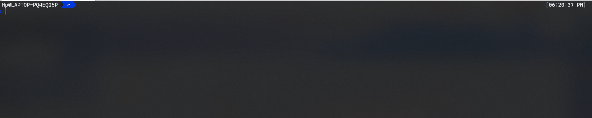
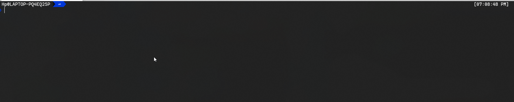
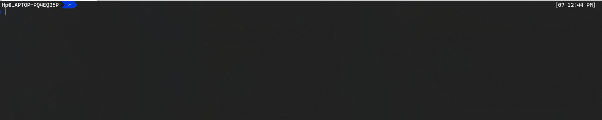
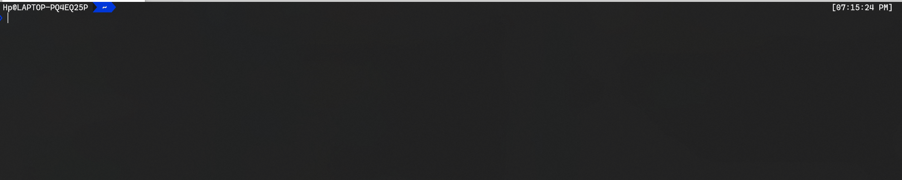
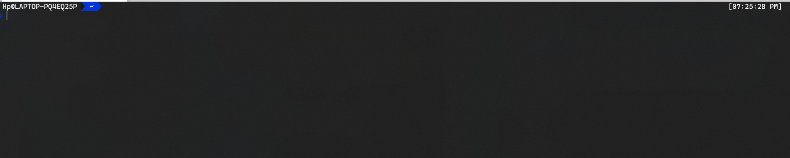
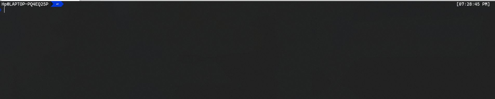

[![Issue Status][issue status badge]][issue status link] [![License Status][license status badge]][license status link] [![Fork Status][fork status badge]][fork status link]

<!-- markdownlint-disable -->

<!-- markdownlint-enable -->

[issue status badge]: https://img.shields.io/github/issues/DevDHera/Crypto-Cli
[issue status link]: https://github.com/DevDHera/Crypto-Cli/issues
[license status badge]: https://img.shields.io/github/license/DevDHera/Crypto-Cli
[license status link]: https://github.com/DevDHera/Crypto-Cli/blob/master/LICENSE
[fork status badge]: https://img.shields.io/github/forks/DevDHera/Crypto-Cli
[fork status link]: https://github.com/DevDHera/Crypto-Cli/network/members

# Crypto-Cli 😎

A simple cryptocurrency price checker in your terminal. Build with ❤ using [Nomics API](http://docs.nomics.com/).

## Demo



## Summary

- [Getting Started](#getting-started)
- [Prerequisites](#prerequisites)
- [Checking CLI Version](#checking-cli-version)
- [Commands](#commands)
- [Built With](#built-with)
- [Contributing](#contributing)
- [Authors](#authors)
- [License](#license)
- [Acknowledgments](#acknowledgments)

## Getting Started

Getting started with the `Crypto-Cli` is easy.

1. First install the Nodejs via [site](https://nodejs.org/en/) or [NVM](https://github.com/nvm-sh/nvm).

2. Install the `Cryto-cli` package gloabally.

```sh
npm i -g @devdhera/crypto-cli
```

3. Get your free API key from [Nomics](https://nomics.com/).

4. Configure `Crypto-cli` with the API key you recieved.

```sh
crypto-cli key set
```

5. Now check the prices.

```sh
crypto-cli check price
```

## Prerequisites

`Crypto-Cli` uses **[Nomics](https://nomics.com/)** to as the cryptocurrency API.

In order to successfully run the cli get an API key.

## Checking CLI Version

Run `cryoto-cli --version` or `cryoto-cli -V` to determine what version you are currently working with.

## Commands

The commands listed below are derived from the latest version of Crypto CLI. You can view the list of commands available with your version in your terminal using `crypto-cli --help`. To learn more about a specific command and its options use `crypto-cli [command] --help`.

### Usage

```sh
crypto-cli [command] [options]
```

<details>
<summary>Set API Key</summary>

```sh
crypto-cli key set
```



</details>

<details>
<summary>Show API Key</summary>

```sh
crypto-cli key show
```



</details>

<details>
<summary>Remove API Key</summary>

```sh
crypto-cli key remove
```



</details>

<details>
<summary>Check Price</summary>

**GENERAL**

```sh
crypto-cli check price
```


**COIN FLAG**

```
crypto-cli check price --coin=BTC
```



**CURRENCY FLAG**

```
crypto-cli check price --cur=LKR
```



</details>

## Built With

- [Commander](https://www.npmjs.com/package/commander) - CLI framework
- [Inquirer](https://www.npmjs.com/package/inquirer) - Interactive CLI user interfaces
- [Configstore](https://www.npmjs.com/package/configstore) - Config storage lib
- [Colors](https://www.npmjs.com/package/colors) - To beautify output
- [Axios](https://www.npmjs.com/package/axios) - HTTP Client

## Contributing

Please read [CODE_OF_CONDUCT.md](https://github.com/DevDHera/Crypto-Cli/blob/master/CODE_OF_CONDUCT.md) for details on our code of conduct, and the process for submitting pull requests to us.

## Authors

- **Devin Herath** - _Initial work_ - [DevDHera](https://github.com/DevDHera)

See also the list of [contributors](https://github.com/DevDHera/Crypto-Cli/graphs/contributors) who participated in this project.

## License

This project is licensed under the MIT License - see the [LICENSE](https://github.com/DevDHera/Crypto-Cli/blob/master/LICENSE) file for details.

## Acknowledgments

- [Brad Traversy](https://github.com/bradtraversy) for this being the guiding light 😇
- [PurpleBooth](https://github.com/PurpleBooth) for this awesome README template ❤
